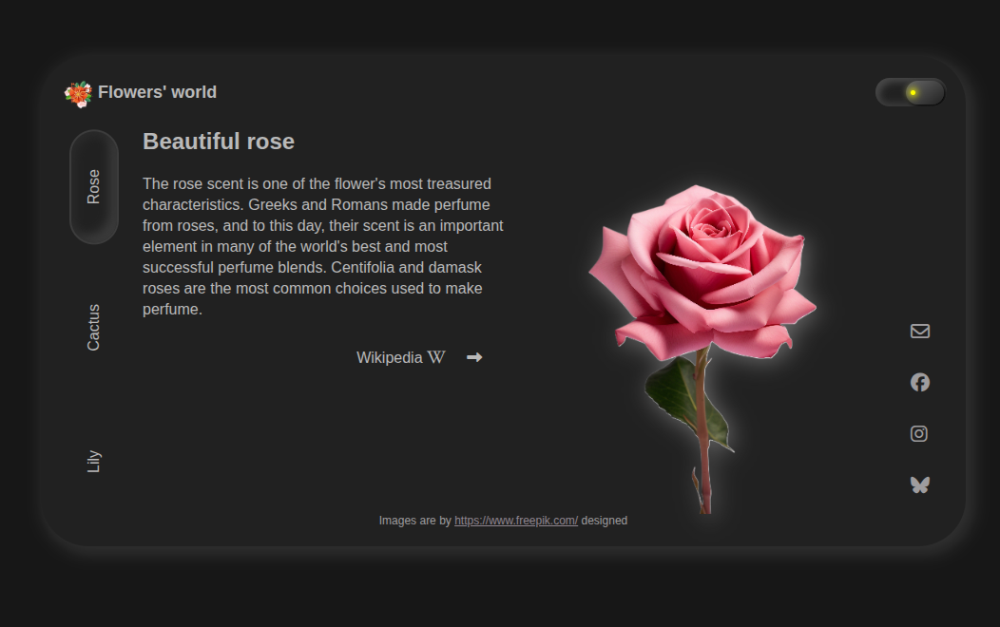
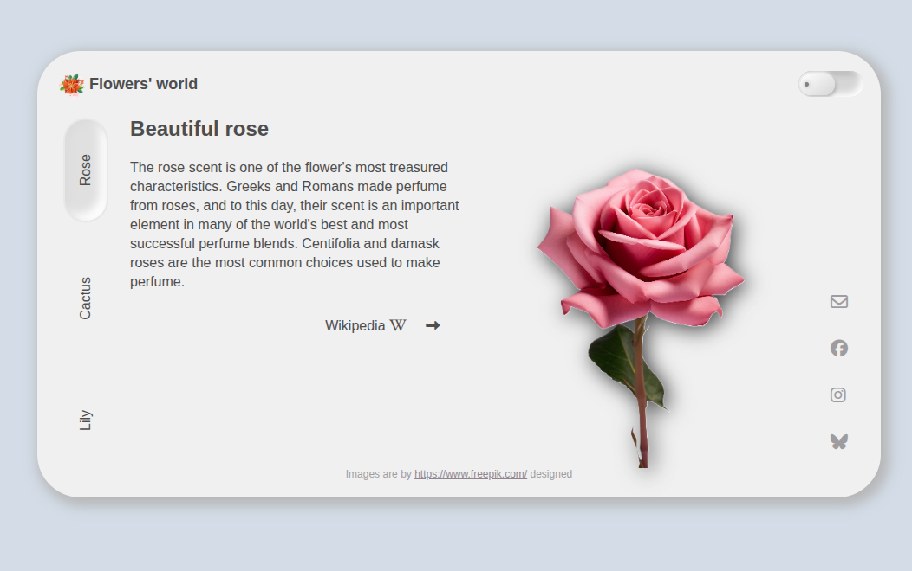

# 💠 Neoromorphism UI Playground

An experimental user interface exploring the concepts of **neomorphism (soft UI)** and **glassmorphism** — built **entirely with vanilla HTML & CSS**, without any JavaScript. Designed to showcase clean, modern, and responsive frontend design.

🔗 **Live Demo**: [https://neoromorphism.vercel.app/](https://neoromorphism.vercel.app/)

---
## 🎯 Purpose
This UI demo was built as a visual and stylistic playground, to study the principles of neomorphism and glassmorphism. It is intentionally non-interactive and built without JavaScript to emphasize what’s possible with just HTML and CSS.

---

## ✨ Highlights

- 🌑 Dark-mode inspired **soft UI** layout
- 🧊 Glass effects, layered shadows & gradients
- 🎨 100% **vanilla CSS**, no frameworks, no JavaScript
- 📱 Mobile-first, fully responsive
- 🧪 Concept UI — non-functional but visually rich

---

## 🧑‍💻 Tech Stack

- **HTML5**
- **CSS3** (custom gradients, shadows, transitions)
- ⚠️ **No JavaScript used**

---

## 📸 Screenshots

| Dark mode | Light mode |
|---------|--------|
|  |  |


---

## 🚀 Local Setup

To explore or modify the code locally:

```bash
git clone https://github.com/marrozhkova/neoromorphism.git
cd neoromorphism
# Open index.html in your browser
```
## 👤 Author

**Maryna Rozhkova**  
Frontend Developer | Learner by Heart  
📫 [mar.rozhkova@gmail.com](mailto:mar.rozhkova@gmail.com)  
🌐 [Portfolio](https://marrozhkova-portfolio.vercel.app/)
